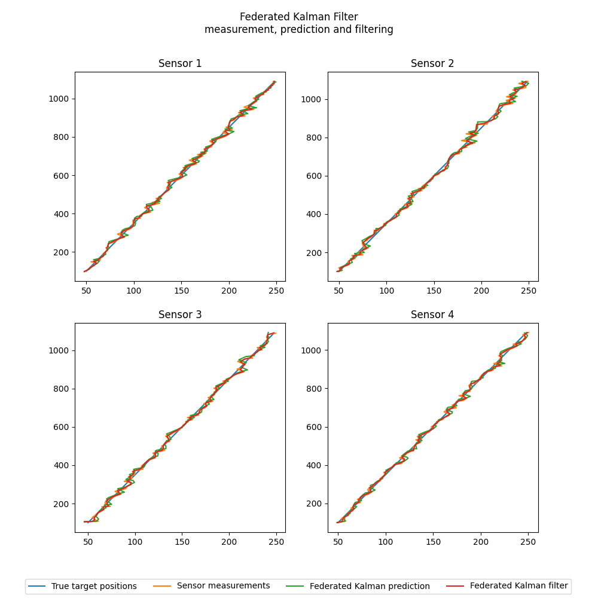
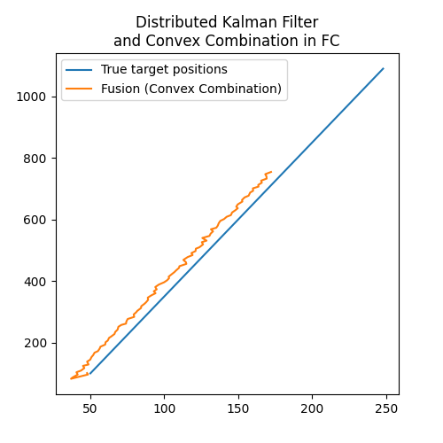

# Advanced Sensor Data Fusion in Distributed Systems

## Program Assignment 
- Simulate a target with motion and process noise.
- 4D state space: $x = (x, y, x’, y’)^\intercal$
- Linear Measurements: $z = (x, y)^\intercal + v$
- $v \sim N (0, R), R = R I, R = 100$.
- Parameter $S =$ number of sensors (e.g. $S = 4$).
- For $k = 1,...$
  - Each sensor produces a measurement.
  - Each sensor uses Kalman Filter for local processing.
  - Its estimate is sent to fusion center (FC) instance.
    1) The FC uses the convex combination for Track-to-Track Fusion
    2) Sensors use Federated Kalman Filter. FC uses Convex Combination
    3) Sensors use Distributed Kalman Filter. FC uses Convex Combination
   
  
## Usage
```sh
python -m venv .venv
.venv\Scripts\activate
pip install -r requirements.txt
python src/main.py
```
# Kalman Filter
Per sensor result of local kalman filter processing


With convex combination fused


# Federated Kalman Filter
Per sensor result of local federated kalman filter processing



With convex combination fused


# Distributed Kalman Filter
Per sensor result of local distributed kalman filter processing


With convex combination fused


